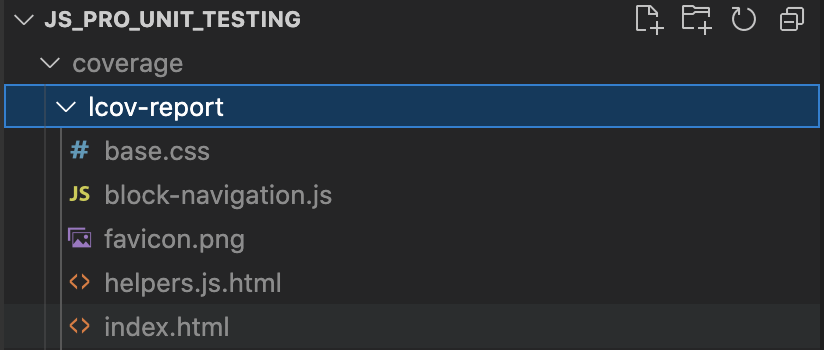
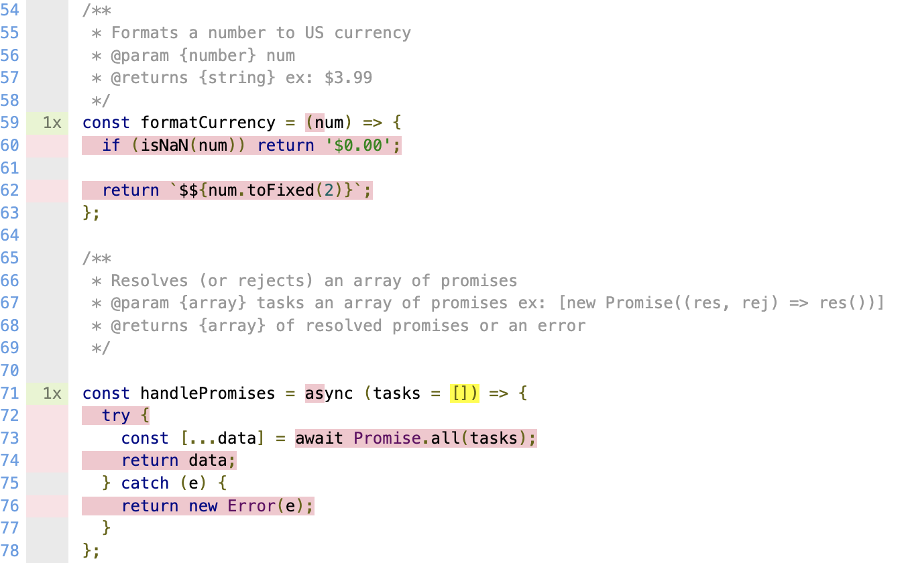
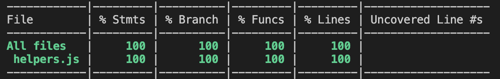

# Unit Testing Intro

### Getting Started

---

```
npm i
npm test (runs tests)
npm run test:coverage (collects coverage metrics)
```

---

### Videos to Watch

---

Intro to Jest:
https://www.loom.com/share/f1cc5c32e96441468c65dae30b9216c6

Testing Async Methods:
https://www.loom.com/share/c0f7523e066345fd9fd18a81a83f8a68

Testing Callbacks and Using Mocks:
https://www.loom.com/share/5361b39e8da14cc9a98feeb4f1419aa8

---

### TODO

---

Run `npm run test:coverage` - you will see that 100% test coverage is not met! Add tests to get this app to 100% coverage.

You will find the coverage files here:



If you open `coverage/lcov-report/index.html` in the browser you will see the uncovered lines that need tests.



Once you make your tests, you should get to 100% like a boss.


